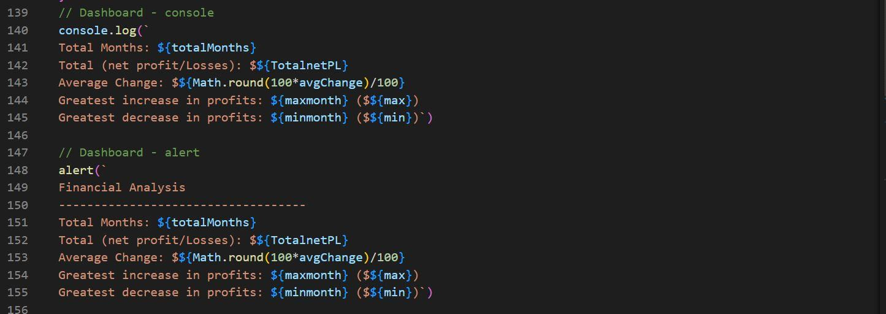

# Console-Finances

## What problem was solved
The financial records for a hypothetical company was analysed using codes written in JavaScript. The financial records was provided in an array composed of arrays with two fields namely; Date and Profit/Losses.

The following were estimated from the analyses;
1. Total number of months in the dataset
2. Net amount of Profit/Losses over the entire period
3. Average of changes in Profit/Losses over the entire period
4. The greatest increase in profits over the entire period with date included
5. The greatest decrease in Losses over the entire period with date included

## How was the problem solved 
The problem was solved sequentially as labelled above. The details of the thought process going into resolving each task is as below; 

### 1. Total Months

As seen in the code above, the length property was called on the array (finances) to obtain total months in the data set

### 2. Net Profit/Losses

The netPL was initalised to zero and for loop was used to iterate through the profit/losses data within the array to form a loop that adds consecutive profit/losses values and updates their cummulative sum in the variable netPL

### 3. Average of changes 

The dateAndChange is an empty array at the beginning of the loop. A for loop was used to iterate through the finances array to calculate changes in profit or Losses value - which is the algebraic difference between consecutive P/L values within the array (see Line 108). In Line 109, each calculated change is appended onto the dateAndChange array together with the date corresponding to the current month. 

Another for loop was created (Line 114-117) to search through the new dateAndChange array and sum up the Change values. The sum obtained is then divided by the total months to obtain the average of changes value required (see Line 119). 

### 4. Greatest Increase and decrease in P/L over the entire period

Variables max, min, maxmonth and minmonth were initialised as the first (corresponding) elements within the array; then, for loop was used to search the array and update these variables based on the given conditions in Line 129 and 134. 

The required outputs of the analysis is summarised by the print codes below; 

##### For better UX
The entire code base was placed inside a function called myFunction. This function was then attached to the html button element - to be called "on-click". 

## Outcome 
#### The console outputs:

#### The browser user interface and outputs:

Here is a link to the deployed application: [Live app](https://eugieno.github.io/Console-Finances/)